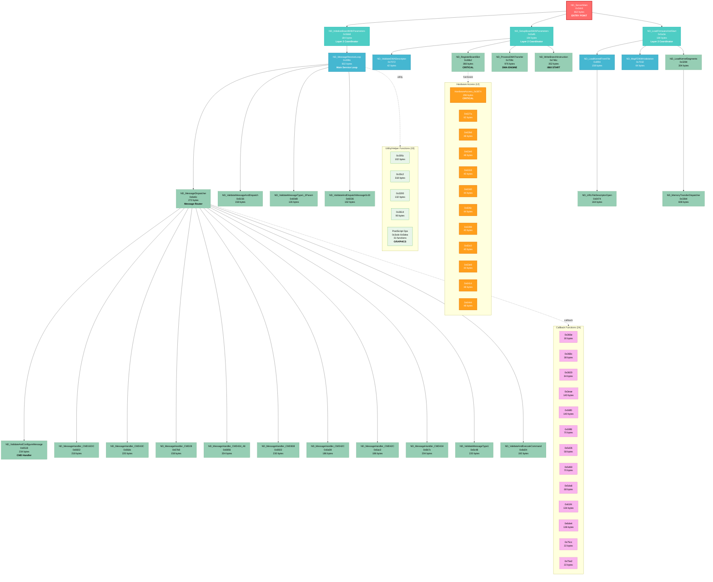

# Complete NDserver Call Graph

This diagram shows all 88 functions in the NDserver binary with their call relationships, organized by analysis layer and category.

## Full Call Graph (88 Functions)



## Statistics

- **Total Functions**: 88
- **Analyzed Functions**: 29 (33%)
- **Isolated Functions**: 59 (67%)
  - Callbacks: 24 (27%)
  - Hardware Access: 12 (14%)
  - Utility/Helper: 33 (38%)

## Layer Distribution

| Layer | Count | Description |
|-------|-------|-------------|
| Layer 3 | 1 | Entry point (ND_ServerMain) |
| Layer 2 | 3 | High-level coordinators (Init, Setup, Load) |
| Layer 1 | 4 | Intermediate orchestrators (Message loop, kernel loading) |
| Layer 0 | 21 | Leaf functions (handlers, validators, DMA, i860 control) |
| Isolated | 59 | Uncalled or indirectly referenced functions |

## Critical Paths

### Boot and Initialization
```
ND_ServerMain → ND_LoadFirmwareAndStart → ND_LoadKernelFromFile → ND_ProcessDMATransfer → ND_WriteBranchInstruction
```

### Message Processing
```
ND_ServerMain → ND_InitializeBoardWithParameters → ND_MessageReceiveLoop → ND_MessageDispatcher → [11 Handlers]
```

### Hardware Configuration
```
ND_ServerMain → ND_SetupBoardWithParameters → ND_RegisterBoardSlot → [Hardware Access Functions]
```

## Color Legend

- **Red (Layer 3)**: Entry point - single root function
- **Teal (Layer 2)**: High-level coordinators - orchestrate major phases
- **Blue (Layer 1)**: Intermediate functions - specialized coordinators
- **Green (Layer 0)**: Leaf functions - actual work implementations
- **Yellow (Isolated)**: Uncalled functions - callbacks, utilities, dead code
- **Pink (Callbacks)**: Function pointers and dispatch table entries
- **Orange (Hardware)**: Direct hardware/MMIO access functions
- **Light Green (Utility)**: Helper functions and PostScript operations

## Notes

1. **Function Sizes**: Range from 22 bytes (tiny callbacks) to 976 bytes (DMA engine)
2. **Largest Function**: `ND_ProcessDMATransfer` at 976 bytes - handles complex DMA transfers
3. **Most Connected**: `ND_MessageDispatcher` connects to 11 different command handlers
4. **Hardware Critical**: `HardwareAccess_0x3874` (296 bytes) accesses MMIO region 0x04010290
5. **PostScript Operations**: 31 utility functions likely implement Display PostScript primitives

## Rendering Notes

- Mermaid may struggle with 88+ nodes - consider using layer-focused views for clarity
- Dotted lines (`.->`) indicate indirect calls (callbacks, function pointers, dispatch tables)
- Bold labels highlight critical architectural components
- Click handlers link to detailed function documentation (GitHub integration required)
