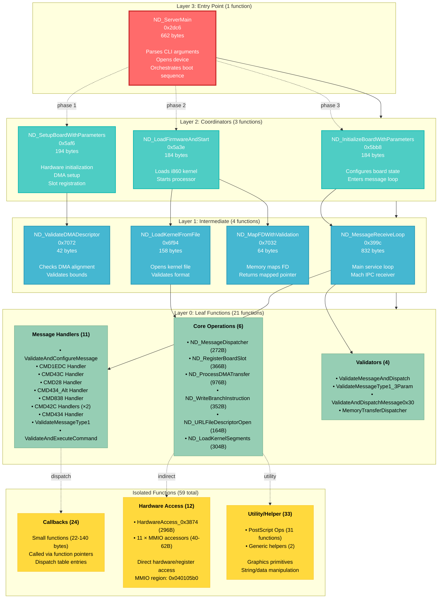

# NDserver Layer-Focused Call Graph

Simplified view showing the hierarchical layer structure of the NDserver architecture.

## Layer Architecture Overview



## Layer Details

### Layer 3: Entry Point (1 function)
**Purpose**: Command-line parsing and boot orchestration

| Function | Size | Complexity | Role |
|----------|------|------------|------|
| ND_ServerMain | 662 bytes | High | Parses `-w <slot>` argument, opens IOKit device, orchestrates 3-phase boot |

**Boot Phases**:
1. **Setup**: Hardware initialization (ND_SetupBoardWithParameters)
2. **Load**: Firmware loading and i860 start (ND_LoadFirmwareAndStart)
3. **Service**: Message loop (ND_InitializeBoardWithParameters → ND_MessageReceiveLoop)

### Layer 2: Coordinators (3 functions)
**Purpose**: High-level phase orchestration

| Function | Size | Calls | Role |
|----------|------|-------|------|
| ND_SetupBoardWithParameters | 194 bytes | 5 | Hardware init, DMA setup, slot registration |
| ND_LoadFirmwareAndStart | 184 bytes | 5 | Kernel loading, i860 processor start |
| ND_InitializeBoardWithParameters | 184 bytes | 5 | Final configuration, enter service loop |

**Key Insight**: Each coordinator makes exactly 5 internal calls, suggesting consistent design pattern.

### Layer 1: Intermediate (4 functions)
**Purpose**: Specialized orchestration for core subsystems

| Function | Size | Calls | Subsystem |
|----------|------|-------|-----------|
| ND_MessageReceiveLoop | 832 bytes | 5 | IPC/Messaging |
| ND_LoadKernelFromFile | 158 bytes | 1 | File I/O |
| ND_MapFDWithValidation | 64 bytes | 1 | Memory mapping |
| ND_ValidateDMADescriptor | 42 bytes | 1 | DMA validation |

**Largest Function**: MessageReceiveLoop at 832 bytes - main service loop handling Mach IPC.

### Layer 0: Leaf Functions (21 functions)
**Purpose**: Actual implementation work - no internal calls to analyzed functions

**Categorization**:

1. **Core Operations (6 functions)**:
   - `ND_MessageDispatcher` (272B) - Routes messages to handlers
   - `ND_RegisterBoardSlot` (366B) - IOKit slot registration
   - `ND_ProcessDMATransfer` (976B) - **Largest function** - complex DMA engine
   - `ND_WriteBranchInstruction` (352B) - Writes i860 boot code, releases reset
   - `ND_URLFileDescriptorOpen` (164B) - Opens file URLs
   - `ND_LoadKernelSegments` (304B) - Parses and loads kernel segments

2. **Message Handlers (11 functions)**:
   - Command-specific handlers (CMD1EDC, CMD43C, CMD28, CMD434, CMD838, CMD42C)
   - Message validators
   - Sizes: 158-234 bytes (consistent pattern)

3. **Validators (4 functions)**:
   - Message validation and dispatch
   - Type checking and parameter validation
   - MemoryTransferDispatcher (608B) - routes memory operations

### Isolated Functions (59 functions)
**Purpose**: Indirectly called via function pointers, dispatch tables, or dead code

**Categories**:

1. **Hardware Access (12 functions)**:
   - Direct MMIO register access
   - Critical: `HardwareAccess_0x3874` (296B) - accesses 0x04010290
   - 11 small accessors (40-62 bytes) - all touch 0x040105b0

2. **Callbacks (24 functions)**:
   - Small (22-140 bytes)
   - Called via function pointers
   - Dispatch table entries
   - Pattern: `link/unlk` stack frame for callbacks

3. **Utility/Helper (33 functions)**:
   - **31 PostScript operations** - Graphics primitives (0x3cdc-0x5dea)
   - 2 generic helpers
   - Sizes: 208-462 bytes

## Execution Flow

### Boot Sequence
```
Start → Layer 3 (Parse CLI)
      ↓
      Layer 2 Phase 1 (Setup Hardware)
      ↓
      Layer 2 Phase 2 (Load Firmware)
      ↓
      Layer 2 Phase 3 (Init & Loop)
      ↓
      Layer 1 (Message Loop)
      ↓
      Layer 0 (Message Dispatch)
      ↓
      Isolated (Handlers execute)
```

### Message Processing Loop
```
MessageReceiveLoop (L1)
  ↓
MessageDispatcher (L0)
  ↓
Command Handlers (L0 + Isolated)
  ↓
Hardware Access (Isolated)
  ↓
Callback Execution (Isolated)
```

## Design Patterns

### Consistent Coordinator Pattern
All Layer 2 coordinators:
- Size: 184-194 bytes (very consistent)
- Internal calls: Exactly 5 each
- Role: Phase orchestration only, no direct work

### Message Handler Pattern
Layer 0 message handlers:
- Size: 158-234 bytes
- Naming: `ND_MessageHandler_CMD<hex>` or `ND_Validate*`
- Consistent validation → dispatch → execute flow

### Callback Pattern
Isolated callbacks:
- Small size (22-140 bytes)
- Stack frame (`link/unlk`)
- 1-2 external calls
- Likely function pointer targets

## Metrics

| Metric | Value |
|--------|-------|
| **Total Functions** | 88 |
| **Average Function Size** | ~200 bytes |
| **Largest Function** | ND_ProcessDMATransfer (976B) |
| **Smallest Functions** | Callbacks (22B) |
| **Call Depth** | 4 layers (0-3) |
| **Isolated Ratio** | 67% (59/88) |
| **Critical Path Length** | 6 functions (Main → Setup → DMA → Transfer) |

## Notes

- **Layer depth**: Shallow 4-layer architecture suggests clean separation of concerns
- **Isolation**: 67% isolated functions typical for event-driven daemon with callbacks
- **Consistency**: Layer 2 shows remarkable consistency (184-194 bytes, 5 calls each)
- **Largest component**: DMA engine at 976 bytes - handles complex scatter-gather DMA
- **Most complex**: MessageReceiveLoop at 832 bytes - Mach IPC state machine
- **Hardware access**: Concentrated in isolated functions (not in main call path)
