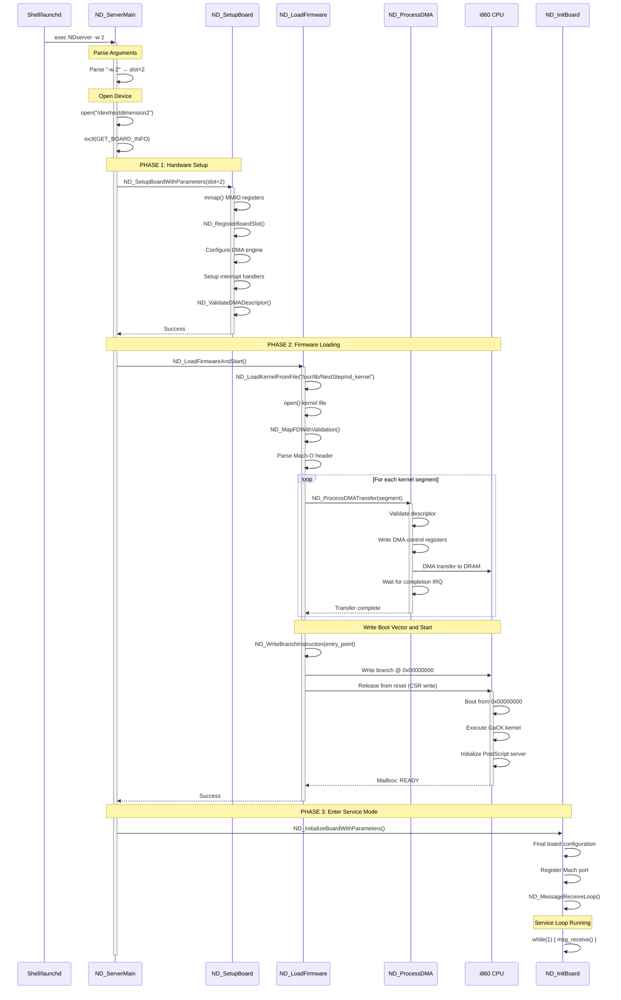
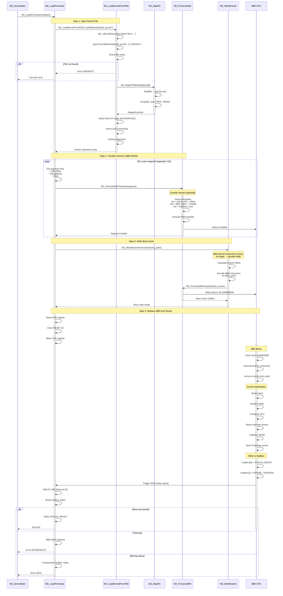
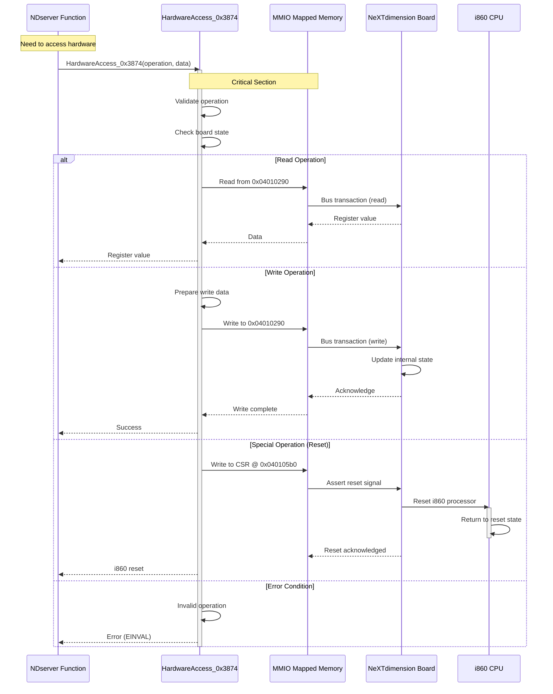

# NDserver Critical Execution Paths

Sequence diagrams showing the most important execution flows through the NDserver daemon.

## 1. Boot and Initialization Sequence



**Duration**: ~500-1000 ms total
- **Phase 1 (Setup)**: ~50 ms
- **Phase 2 (Firmware Load)**: ~400-800 ms (depends on kernel size)
- **Phase 3 (Service Entry)**: ~50 ms

## 2. Message Processing Flow

```mermaid
sequenceDiagram
    participant Client as Client App
    participant Mach as Mach IPC Kernel
    participant Loop as ND_MessageLoop
    participant Dispatch as ND_Dispatcher
    participant Handler as Command Handler
    participant i860 as i860 DPS Server

    Note over Client: User calls DPS API
    Client->>Client: DPSPrintf("stroke")

    Note over Client,Mach: Send Message
    Client->>Mach: mach_msg(SEND, ndserver_port)
    Mach->>Mach: Queue message

    Note over Loop: Waiting for messages
    Loop->>Mach: msg_receive(port_set)
    Mach-->>Loop: Message delivered

    activate Loop

    Note over Loop: Validate Message
    Loop->>Loop: Check message size
    Loop->>Loop: Validate command ID
    Loop->>Loop: Extract parameters

    alt Valid Message
        Loop->>Dispatch: ND_MessageDispatcher(msg)
        activate Dispatch

        Note over Dispatch: Route by Command ID
        Dispatch->>Dispatch: switch(msg->command)

        alt CMD 0x43c (DPS Execute)
            Dispatch->>Handler: ND_ValidateAndConfigureMessage()
            activate Handler

            Handler->>Handler: Parse PostScript data
            Handler->>Handler: Validate syntax
            Handler->>Handler: Setup shared memory

            Note over Handler,i860: Send to i860
            Handler->>i860: Write to mailbox
            Handler->>i860: Set doorbell bit

            activate i860
            i860->>i860: Read mailbox
            i860->>i860: Execute PostScript
            i860->>i860: Render to VRAM
            i860->>Handler: Trigger IRQ (completion)
            deactivate i860

            Handler->>Handler: Read result from mailbox
            Handler-->>Dispatch: Result data
            deactivate Handler

        else CMD 0x28 (Unknown)
            Dispatch->>Handler: ND_MessageHandler_CMD28()
            activate Handler
            Handler->>Handler: Process command
            Handler-->>Dispatch: Result
            deactivate Handler

        else Other Commands
            Dispatch->>Handler: ND_MessageHandler_CMD*()
            Handler-->>Dispatch: Result
        end

        Dispatch-->>Loop: Handler result
        deactivate Dispatch

        Note over Loop,Mach: Send Reply
        Loop->>Loop: Build reply message
        Loop->>Mach: mach_msg(SEND, reply_port)

    else Invalid Message
        Loop->>Loop: Build error reply
        Loop->>Mach: mach_msg(SEND, error)
    end

    Mach-->>Client: Reply delivered
    Client->>Client: Return to application

    deactivate Loop

    Note over Loop: Continue waiting...
    Loop->>Mach: msg_receive() [loop]
```

**Latency Breakdown**:
1. **Client → Kernel**: ~50 μs (mach_msg syscall)
2. **Kernel → NDserver**: ~50 μs (context switch + delivery)
3. **Validation**: ~10-20 μs
4. **Dispatch**: ~5 μs
5. **Handler**: ~10-50 μs
6. **Mailbox write**: ~5 μs
7. **i860 execution**: **100 μs - 10 ms** (varies widely!)
8. **Interrupt + read**: ~50 μs
9. **Reply send**: ~100 μs

**Total**: ~400 μs (fast path) to 10+ ms (complex rendering)

## 3. DMA Transfer Sequence

```mermaid
sequenceDiagram
    participant Client as Client (e.g., texture upload)
    participant NDServer as NDserver
    participant Validate as ND_ValidateDMA
    participant DMA as ND_ProcessDMA
    participant Hardware as DMA Engine
    participant i860 as i860 VRAM

    Client->>NDServer: Upload texture request
    Note over Client: Mach message with:<br/>• Source buffer<br/>• Destination offset<br/>• Size

    NDServer->>NDServer: Parse request
    NDServer->>NDServer: Get source buffer (OOL data)

    Note over NDServer,Validate: Validate DMA Parameters
    NDServer->>Validate: ND_ValidateDMADescriptor()
    activate Validate

    Validate->>Validate: Check alignment (4-byte)
    Validate->>Validate: Check src/dst ranges
    Validate->>Validate: Check size limits
    Validate->>Validate: Check flags

    alt Valid
        Validate-->>NDServer: OK
        deactivate Validate

        Note over NDServer,Hardware: Setup and Execute DMA
        NDServer->>DMA: ND_ProcessDMATransfer()
        activate DMA

        DMA->>DMA: Build DMA descriptor
        DMA->>DMA: Set src = client buffer
        DMA->>DMA: Set dst = board VRAM offset
        DMA->>DMA: Set length = texture size
        DMA->>DMA: Set flags = HOST_TO_BOARD

        Note over DMA,Hardware: Write to Hardware
        DMA->>Hardware: Write descriptor to MMIO
        DMA->>Hardware: Write DMA_START bit

        activate Hardware
        Note over Hardware: DMA Engine Execution
        Hardware->>Hardware: Assert bus master
        Hardware->>Hardware: Read from host RAM

        loop Transfer chunks
            Hardware->>Hardware: Read 32-bit word
            Hardware->>i860: Write to VRAM
        end

        Hardware->>Hardware: Transfer complete
        Hardware->>DMA: Trigger IRQ
        deactivate Hardware

        Note over DMA: Wait for Completion
        DMA->>DMA: select(nd_fd, timeout=1s)
        DMA->>DMA: IRQ received
        DMA->>DMA: Read DMA status register

        alt Success
            DMA->>DMA: Verify byte count
            DMA-->>NDServer: Success (bytes transferred)

        else Timeout
            DMA->>DMA: Check error register
            DMA->>Hardware: Abort transfer
            DMA-->>NDServer: Error (ETIMEDOUT)

        else Bus Error
            DMA->>DMA: Read error flags
            DMA->>Hardware: Clear error state
            DMA-->>NDServer: Error (EIO)
        end

        deactivate DMA

    else Invalid Parameters
        Validate-->>NDServer: Error (EINVAL)
        deactivate Validate
    end

    NDServer->>Client: Reply (success or error)
    Note over i860: Texture now in VRAM<br/>Ready for rendering
```

**Transfer Performance**:
- **Setup overhead**: ~50 μs
- **Small transfer (4KB)**: ~100 μs @ 40 MB/s
- **Large transfer (1MB)**: ~25 ms @ 40 MB/s
- **Validation overhead**: ~10 μs

**Error Cases**:
1. **Invalid alignment**: Return EINVAL immediately
2. **Timeout (1 second)**: Abort, return ETIMEDOUT
3. **Bus error**: Clear DMA state, return EIO

## 4. Firmware Load and i860 Start



**Boot Timeline**:
1. **File open**: ~1-5 ms (disk I/O)
2. **Memory map**: ~1 ms
3. **Parse Mach-O**: ~1-10 ms
4. **DMA transfers**: ~400-800 ms (depends on kernel size, typically 1-2 MB)
5. **Write boot vector**: ~1 ms
6. **i860 kernel init**: ~50-100 ms
7. **PostScript server start**: ~50 ms

**Total**: ~500 ms - 1 second

## 5. Hardware Register Access



**Access Latency**:
- **MMIO read**: ~100-200 ns (bus transaction)
- **MMIO write**: ~100-200 ns
- **Function overhead**: ~50 μs (validation, error checking)
- **Total**: ~50 μs per access

## 6. Error Recovery Path

```mermaid
sequenceDiagram
    participant Client as Client App
    participant Loop as Message Loop
    participant Handler as Command Handler
    participant i860 as i860 CPU
    participant Recovery as Error Recovery

    Client->>Loop: Send DPS command
    Loop->>Handler: Dispatch command
    Handler->>i860: Write to mailbox

    Note over i860: i860 Crashes!
    i860->>i860: Illegal instruction / fault
    i860->>i860: Processor halts

    Note over Handler: Wait for Response
    Handler->>Handler: select(timeout=1s)

    Note over Handler: Timeout!
    Handler->>Handler: No IRQ received
    Handler->>Handler: No mailbox update

    Handler->>Recovery: Handle i860 crash
    activate Recovery

    Note over Recovery: Detect Fault
    Recovery->>Recovery: Read CSR register
    Recovery->>Recovery: Check fault bits
    Recovery->>Recovery: Log error state

    Note over Recovery: Reset i860
    Recovery->>Recovery: Write RESET to CSR
    Recovery->>i860: Assert reset signal
    i860->>i860: Return to reset state

    Note over Recovery: Reload Firmware
    Recovery->>Recovery: ND_LoadFirmwareAndStart()
    Recovery->>i860: Transfer kernel
    Recovery->>i860: Release from reset
    i860->>i860: Boot kernel

    alt Recovery Successful
        i860-->>Recovery: READY signal
        Recovery->>Recovery: Board operational
        Recovery-->>Handler: Recovered
        Handler-->>Loop: Error (EIO) + retry hint
        Loop-->>Client: Temporary failure

    else Recovery Failed
        Recovery->>Recovery: Multiple retries failed
        Recovery-->>Handler: Fatal error
        Handler-->>Loop: Error (ENXIO)
        Loop-->>Client: Fatal error - board unusable
    end

    deactivate Recovery
```

**Recovery Timeline**:
1. **Detect timeout**: 1 second (watchdog)
2. **Read error state**: ~1 ms
3. **Reset i860**: ~10 ms
4. **Reload firmware**: ~500 ms
5. **Verify operational**: ~100 ms

**Total**: ~1.6 seconds

## Performance Summary

| Operation | Fast Path | Typical | Worst Case |
|-----------|-----------|---------|------------|
| **Boot sequence** | 500 ms | 800 ms | 2 seconds |
| **Message dispatch** | 200 μs | 500 μs | 2 ms |
| **DMA transfer (4KB)** | 100 μs | 150 μs | 500 μs |
| **DMA transfer (1MB)** | 25 ms | 30 ms | 50 ms |
| **DPS simple command** | 400 μs | 1 ms | 10 ms |
| **DPS complex render** | 5 ms | 20 ms | 100 ms |
| **i860 recovery** | N/A | 1.6 s | 5 seconds |

## Critical Path Bottlenecks

1. **Firmware loading**: Limited by DMA bandwidth (~40 MB/s)
2. **Message latency**: Limited by Mach IPC overhead (~100 μs)
3. **i860 rendering**: Variable, depends on PostScript complexity
4. **DMA setup**: MMIO register writes (~50 μs overhead)
5. **Error recovery**: Slow (1+ second), but rare

## Optimization Opportunities

1. **Firmware caching**: Keep kernel in memory, skip file I/O on restart
2. **DMA descriptor caching**: Pre-build common descriptors
3. **Message batching**: Combine multiple small commands
4. **Asynchronous operations**: Don't block on i860 completion
5. **Interrupt coalescing**: Reduce IRQ overhead for bulk operations
