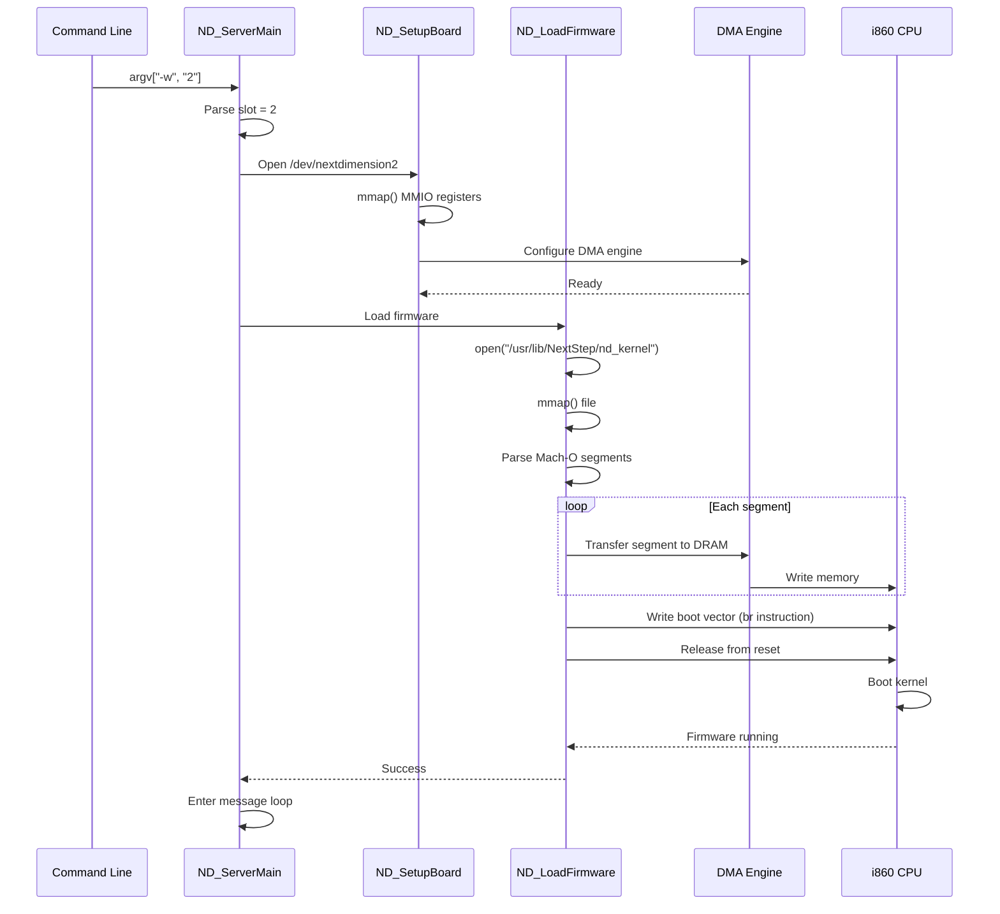
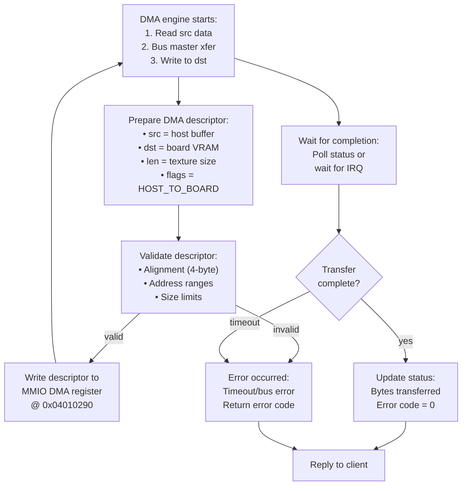

# NDserver Data Flow Diagram

Visualization of how data flows through the NDserver daemon from command line to hardware operations.

## High-Level Data Flow

```mermaid
flowchart LR
    %% External entities
    CLI["Command Line<br/>NDserver -w 2"]
    Client["Client Application<br/>(WindowServer, Apps)"]
    NDBoard["NeXTdimension Board<br/>Slot 2"]

    %% Main components
    subgraph UserSpace["User Space"]
        Parse["Argument Parser<br/><br/>Extracts:<br/>• Slot number<br/>• Debug flags"]

        IOKitOpen["IOKit Device Open<br/><br/>Opens:<br/>/dev/nextdimension2"]

        Setup["Hardware Setup<br/><br/>Configures:<br/>• MMIO mappings<br/>• Interrupt handlers<br/>• DMA engine"]

        FWLoad["Firmware Loader<br/><br/>Loads:<br/>• i860 kernel<br/>• Boot vectors<br/>• Init code"]

        MsgLoop["Message Loop<br/><br/>Mach IPC Server:<br/>• Receives messages<br/>• Dispatches commands<br/>• Returns results"]
    end

    subgraph KernelSpace["Kernel Space"]
        IOKit["IOKit Driver<br/><br/>Manages:<br/>• Device enumeration<br/>• Register mapping<br/>• Interrupt routing"]

        MachIPC["Mach IPC<br/><br/>Provides:<br/>• Message ports<br/>• Port rights<br/>• Message queues"]
    end

    subgraph Hardware["Hardware"]
        NeXTBus["NeXTBus Controller<br/><br/>Physical:<br/>• Slot detection<br/>• Address decode<br/>• Interrupt signals"]

        i860["i860 CPU @ 33MHz<br/><br/>Executes:<br/>• Display PostScript<br/>• Graphics ops<br/>• Rendering"]

        VRAM["Video RAM 4MB<br/><br/>Contains:<br/>• Frame buffer<br/>• Texture cache<br/>• Color lookup tables"]

        DRAM["System DRAM<br/>8-64MB<br/><br/>Holds:<br/>• Kernel code<br/>• PostScript state<br/>• Working memory"]
    end

    %% Data flow arrows
    CLI -->|argv| Parse
    Parse -->|"/dev/nextdimension2"| IOKitOpen
    IOKitOpen -->|file descriptor| Setup
    Setup -->|configured device| FWLoad
    FWLoad -->|running board| MsgLoop

    IOKitOpen -.ioctl().-> IOKit
    MsgLoop -.msg_receive().-> MachIPC

    Client -->|"Mach Messages<br/>(DPS commands)"| MachIPC
    MachIPC -->|deliver| MsgLoop
    MsgLoop -->|results| MachIPC
    MachIPC -->|reply| Client

    IOKit <-->|"MMIO Read/Write<br/>Bus Master DMA"| NeXTBus
    Setup -->|DMA transfers| NeXTBus
    FWLoad -->|kernel code| NeXTBus
    MsgLoop -->|command data| NeXTBus

    NeXTBus -->|"Slot 2 Bus"| NDBoard
    NDBoard --> i860
    NDBoard --> VRAM
    NDBoard --> DRAM

    i860 <-->|read/write| VRAM
    i860 <-->|execute from| DRAM

    %% Styling
    style CLI fill:#e3f2fd
    style Client fill:#e3f2fd
    style UserSpace fill:#f3e5f5
    style KernelSpace fill:#fff9c4
    style Hardware fill:#fff3e0
    style NDBoard fill:#ffccbc
```



## Detailed Data Structures

### 1. Command Line Arguments
```c
struct cli_args {
    int slot;           // -w parameter (0-3)
    bool debug;         // -d flag
    bool verbose;       // -v flag
};
```

**Flow**: `argv[]` → Parse → `slot_number` → IOKit device path

### 2. IOKit Device Descriptor
```c
struct device_handle {
    int fd;                    // File descriptor
    void *mmio_base;          // Mapped MMIO registers
    size_t mmio_size;         // Mapping size
    uint32_t board_id;        // Hardware ID
};
```

**Flow**: `ioctl(OPEN_DEVICE)` → Kernel → Returns `fd` → `mmap()` → `mmio_base`

### 3. Firmware Image
```c
struct firmware_image {
    uint32_t magic;           // 0xFEEDFACE (Mach-O)
    uint32_t entry_point;     // i860 entry address
    segment_t segments[];     // Code/data segments
    size_t total_size;        // Image size
};
```

**Flow**: File → `open()` → `mmap()` → Parse → DMA to DRAM → `i860.pc = entry_point`

### 4. Mach Message Format
```c
struct ndserver_message {
    mach_msg_header_t header;     // Standard Mach header
    uint32_t command;             // Command ID (0x28, 0x43c, etc.)
    uint32_t param1;              // Command-specific
    uint32_t param2;
    uint32_t param3;
    void *data_ptr;               // OOL data pointer
    size_t data_len;              // Data length
};
```

**Flow**: Client → `mach_msg()` → Kernel queue → `msg_receive()` → Dispatch → Handler

### 5. DMA Descriptor
```c
struct dma_descriptor {
    uint32_t src_addr;        // Source address
    uint32_t dst_addr;        // Destination address
    uint32_t length;          // Transfer length
    uint32_t flags;           // Control flags
    // Bits:
    // [0]: Direction (0=host→board, 1=board→host)
    // [1]: Chained (next descriptor follows)
    // [2-3]: Transfer width (8/16/32-bit)
    // [4]: Interrupt on completion
};
```

**Flow**: Setup → Validate → Write to MMIO → DMA engine executes → IRQ → Status check

### 6. Hardware Register Access
```c
struct nd_registers {
    volatile uint32_t *csr;       // Control/Status @ 0x040105b0
    volatile uint32_t *dma_ctrl;  // DMA control @ 0x04010290
    volatile uint32_t *i860_reset;// Reset control
    volatile uint32_t *mailbox;   // Host/i860 mailbox
};
```

**Flow**: `mmio_base[OFFSET]` → Bus transaction → NeXTBus → Slot 2 decode → Register

## Data Flow Scenarios

### Scenario 1: Boot Sequence



### Scenario 2: Display PostScript Command

```mermaid
sequenceDiagram
    participant App as Client App
    participant Mach as Mach IPC
    participant Loop as Message Loop
    participant Dispatch as Dispatcher
    participant Handler as Command Handler
    participant i860 as i860 CPU
    participant VRAM as Video RAM

    App->>Mach: mach_msg(DPS_RENDER, params)
    Mach->>Loop: msg_receive()
    Loop->>Loop: Validate message
    Loop->>Dispatch: Route by command ID
    Dispatch->>Handler: CMD_0x43c (render)

    Handler->>Handler: Parse PostScript
    Handler->>i860: Write command to mailbox
    i860->>i860: Execute PostScript interpreter

    loop Render operations
        i860->>VRAM: Write pixel data
    end

    i860-->>Handler: Complete (IRQ)
    Handler->>Loop: Build reply message
    Loop->>Mach: mach_msg_send(result)
    Mach->>App: Reply delivered
```

### Scenario 3: DMA Transfer (Host → Board)



## Memory Regions

### Host (68040) View

```
0x00000000 - 0x03FFFFFF : Main RAM (64MB)
0x04010000 - 0x04010FFF : NeXTdimension MMIO (4KB)
  └── 0x04010290        : DMA control register
  └── 0x040105b0        : CSR register
0x08000000 - 0x0BFFFFFF : NeXTdimension DRAM (64MB window)
0x10000000 - 0x103FFFFF : NeXTdimension VRAM (4MB window)
```

### NeXTdimension (i860) View

```
0x00000000 - 0x03FFFFFF : Local DRAM (8-64MB)
  └── 0x00000000        : Boot vector
  └── 0x00001000        : Kernel code
0x08000000 - 0x0BFFFFFF : Host shared memory window
0x10000000 - 0x103FFFFF : Local VRAM (4MB)
  └── 0x10000000        : Frame buffer base
0xFFF00000 - 0xFFFFFFFF : Boot ROM (Read-only)
```

## Data Transformation Pipeline

### Input: Client DPS Command
```
"0 0 moveto 100 100 lineto stroke"
```

### Stage 1: Mach Message Serialization
```c
mach_msg_header_t {
    msgh_bits = MACH_MSG_TYPE_COPY_SEND,
    msgh_size = sizeof(ndserver_message),
    msgh_remote_port = ndserver_port,
    msgh_local_port = reply_port,
}
message_data = "0 0 moveto 100 100 lineto stroke"
```

### Stage 2: NDserver Processing
```c
command = CMD_DPS_EXECUTE  // 0x43c
params = {
    ptr = message_data,
    len = strlen(message_data),
    flags = DPS_FLAG_STROKE
}
```

### Stage 3: i860 Mailbox Format
```c
i860_mailbox[0] = 0x43c           // Command
i860_mailbox[1] = 0x08xxxxxx      // Data in shared memory
i860_mailbox[2] = 31              // Length
i860_mailbox[3] = 0x0001          // Flags
write_register(MAILBOX_DOORBELL, 1);  // Trigger i860
```

### Stage 4: i860 Execution
```
1. Read mailbox
2. Parse PostScript tokens
3. Execute graphics operations:
   - moveto(0, 0)   → Set current point
   - lineto(100,100)→ Build path
   - stroke()       → Rasterize to VRAM
4. Write result to mailbox
5. Trigger host interrupt
```

### Output: VRAM Pixels
```
VRAM[0x10000000 + y*1120 + x] = pixel_color
(Line from (0,0) to (100,100) drawn)
```

## Bandwidth Analysis

### DMA Performance
- **Peak bandwidth**: ~40 MB/s (NeXTBus @ 25MHz, 32-bit)
- **Typical transfer**: 4KB texture upload = ~100 μs
- **Latency**: Setup overhead ~50 μs + transfer time

### Message Latency
- **Mach IPC latency**: ~100 μs (context switch + delivery)
- **Dispatch overhead**: ~20 μs (validation + routing)
- **Total roundtrip**: ~200-500 μs for simple commands

### i860 Processing
- **PostScript parsing**: ~1-10 μs per token
- **Simple graphics op**: ~10-100 μs
- **Complex render**: 1-10 ms (depends on scene complexity)

## Error Flows

### Invalid Message
```
Client → Mach IPC → Message Loop → Validate → REJECT
                                             ↓
                                    Error Reply → Client
```

### DMA Timeout
```
Setup DMA → Wait for completion → Timeout (1 second)
                                  ↓
                          Check error register
                                  ↓
                          Return ETIMEDOUT → Client
```

### i860 Crash
```
Command sent → i860 fault → No mailbox reply → Timeout
                                              ↓
                                      Reset i860 → Reload firmware
                                                  ↓
                                          Return EIO → Client
```

## Notes

- **Async nature**: Most operations are asynchronous (DMA, i860 execution)
- **Buffering**: Large data uses Out-of-Line (OOL) Mach messages (passed by reference)
- **Endianness**: Both 68040 and i860 are big-endian (no conversion needed)
- **Cache coherency**: DMA requires cache flush on 68040 before transfer
- **Interrupts**: Board can interrupt host via NeXTBus IRQ for completion notification
