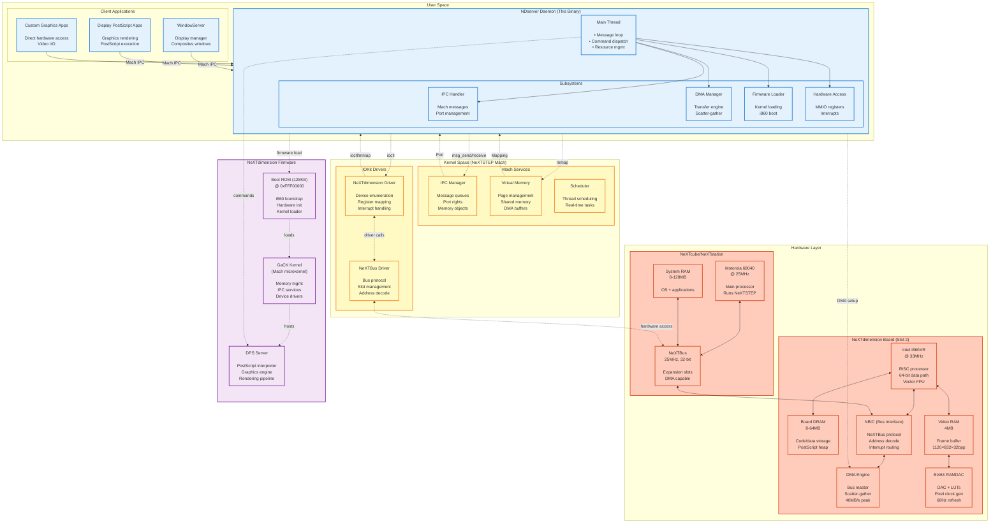

# NDserver Module Architecture

High-level system architecture showing the interaction between NDserver daemon, kernel components, and hardware.

## System Architecture Overview



## Component Details

### User Space Components

#### Client Applications
| Component | Purpose | Communication |
|-----------|---------|---------------|
| WindowServer | Display management, window compositing | Mach messages (DPS commands) |
| DPS Apps | Graphics-intensive applications | Mach messages (rendering) |
| Custom Apps | Video I/O, specialized graphics | Mach messages + shared memory |

**Interface**: Mach IPC ports (send/receive rights)

#### NDserver Daemon
**Executable**: `/usr/lib/NextStep/NDserver`
**Launch**: Automatically on boot (if ND board detected)
**Privileges**: Root (for IOKit access)

**Subsystems**:

1. **IPC Handler** (ND_MessageReceiveLoop, ND_MessageDispatcher)
   - Receives Mach messages from clients
   - Routes to appropriate command handlers
   - Returns results via reply ports

2. **DMA Manager** (ND_ProcessDMATransfer, ND_ValidateDMADescriptor)
   - Configures DMA descriptors
   - Manages scatter-gather transfers
   - Handles completion interrupts

3. **Firmware Loader** (ND_LoadFirmwareAndStart, ND_LoadKernelFromFile)
   - Loads i860 kernel from disk
   - Transfers to board DRAM via DMA
   - Releases i860 from reset

4. **Hardware Access** (ND_RegisterBoardSlot, HardwareAccess_*)
   - MMIO register access
   - Interrupt handling
   - Board configuration

### Kernel Space Components

#### Mach Services

1. **IPC Manager**
   - Port-based message passing
   - Port rights management (send, receive, send-once)
   - Message queuing and delivery
   - **NDserver ports**: Command port, reply ports

2. **Virtual Memory**
   - Page mapping (mmap for MMIO)
   - Shared memory objects (for large data transfers)
   - DMA buffer allocation (wired pages)
   - Cache management

3. **Scheduler**
   - Thread scheduling (NDserver main thread)
   - Real-time priority (for time-critical graphics)
   - IPC priority inheritance

#### IOKit Drivers

1. **NeXTdimension Driver**
   - Device enumeration (PCI-like probing)
   - MMIO region mapping
   - Interrupt registration
   - **ioctl commands**: Configure, reset, status

2. **NeXTBus Driver**
   - Slot detection and configuration
   - Address space management
   - Bus arbitration
   - Interrupt routing (slot → CPU IRQ)

### Hardware Components

#### Host System

1. **Motorola 68040 @ 25MHz**
   - Main processor
   - Runs NeXTSTEP OS
   - Issues DMA requests
   - Handles interrupts from ND board

2. **System RAM (8-128MB)**
   - OS kernel
   - Application code/data
   - DMA source/destination buffers

3. **NeXTBus**
   - 32-bit address, 32-bit data
   - 25MHz clock
   - 4 expansion slots
   - Bus master capable (for DMA)

#### NeXTdimension Board

1. **Intel i860XR @ 33MHz**
   - 64-bit RISC processor
   - Dual-mode (64-bit + 32-bit compatibility)
   - On-chip FPU and graphics unit
   - Executes GaCK kernel + DPS server

2. **Board DRAM (8-64MB)**
   - Dedicated memory for i860
   - Stores kernel code
   - PostScript heap and state
   - Accessible from host via window

3. **Video RAM (4MB)**
   - Frame buffer: 1120×832 @ 32bpp = 3.7MB
   - Remaining space: texture cache, off-screen buffers
   - Dual-ported (i860 + RAMDAC access)

4. **NBIC (NeXTBus Interface Chip)**
   - Custom ASIC
   - Translates NeXTBus ↔ local bus
   - Address decoder
   - Interrupt controller

5. **DMA Engine**
   - Bus master capability
   - Scatter-gather support
   - Bidirectional (host ↔ board)
   - 40MB/s peak bandwidth

6. **Bt463 RAMDAC**
   - 220MHz DAC
   - Triple 8-bit DACs (RGB)
   - Color lookup tables (256 entries)
   - Pixel clock generator (68Hz refresh)

### Firmware Components

#### Boot ROM (128KB)
**Location**: On ND board, mapped to i860 @ 0xFFF00000
**Purpose**:
- i860 reset vector
- Hardware initialization
- DRAM test
- Kernel loader

**Boot Sequence**:
1. i860 reset → fetch from 0xFFF1FF20
2. Initialize caches, FPU
3. Test DRAM (walking 1s/0s)
4. Wait for host to load kernel
5. Jump to kernel entry point

#### GaCK Kernel
**Location**: Loaded to DRAM @ 0x00001000 by NDserver
**Size**: ~1-2MB
**Based on**: Mach 2.5 microkernel

**Services**:
- Task/thread management
- Virtual memory (i860 MMU)
- IPC (mailbox-based, not full Mach IPC)
- Device drivers (VRAM, DMA)

#### Display PostScript Server
**Location**: Part of GaCK kernel
**Purpose**: Graphics rendering

**Components**:
- PostScript interpreter (Level 2)
- Rendering pipeline
- Font cache
- Image operators

## Communication Protocols

### 1. Client → NDserver (Mach IPC)

**Port Setup**:
```c
// NDserver bootstrap
port_allocate(task_self(), &ndserver_port);
port_set_add(task_self(), port_set, ndserver_port);
netname_check_in(name_server, "NeXTdimension", ndserver_port);

// Client lookup
netname_look_up(name_server, "NeXTdimension", &ndserver_port);
```

**Message Format**:
```c
typedef struct {
    mach_msg_header_t header;
    mach_msg_type_t type;
    uint32_t command;       // Command ID
    uint32_t params[3];     // Command-specific
    vm_offset_t data;       // OOL data
    vm_size_t data_len;
} ndserver_msg_t;
```

**Commands**:
- `0x28`: Unknown command
- `0x42c`: Unknown command
- `0x434`: Unknown command
- `0x43c`: DPS execute (likely)
- `0x838`: Unknown command
- `0x1edc`: Unknown command

### 2. NDserver → IOKit (ioctl)

**Device Open**:
```c
fd = open("/dev/nextdimension2", O_RDWR);
```

**ioctl Commands** (hypothetical):
```c
#define ND_IOCTL_RESET      _IO('N', 1)
#define ND_IOCTL_CONFIG     _IOW('N', 2, nd_config_t)
#define ND_IOCTL_DMA_SETUP  _IOW('N', 3, dma_desc_t)
#define ND_IOCTL_IRQ_WAIT   _IOR('N', 4, uint32_t)
```

**MMIO Mapping**:
```c
mmio_base = mmap(NULL, 4096, PROT_READ|PROT_WRITE,
                 MAP_SHARED, fd, 0);
```

### 3. NDserver → i860 (Mailbox)

**Mailbox Registers** (MMIO):
```c
#define MAILBOX_BASE     0x04010500
#define MB_STATUS        (MAILBOX_BASE + 0x00)
#define MB_COMMAND       (MAILBOX_BASE + 0x04)
#define MB_DATA_PTR      (MAILBOX_BASE + 0x08)
#define MB_DATA_LEN      (MAILBOX_BASE + 0x0C)
```

**Protocol**:
```c
// Host → i860
while (*(uint32_t*)MB_STATUS & MB_BUSY);  // Wait
*(uint32_t*)MB_COMMAND = cmd;
*(uint32_t*)MB_DATA_PTR = shared_mem_offset;
*(uint32_t*)MB_DATA_LEN = len;
*(uint32_t*)MB_STATUS |= MB_DOORBELL;     // Trigger

// i860 → Host (interrupt)
if (irq_triggered) {
    result = *(uint32_t*)MB_STATUS;
    // Process result
}
```

### 4. DMA Protocol

**Setup**:
```c
struct dma_descriptor {
    uint32_t src;       // Host or board address
    uint32_t dst;       // Host or board address
    uint32_t len;       // Byte count
    uint32_t next;      // Next descriptor (chained)
    uint32_t flags;     // Control bits
};

// Write to DMA control register
*(dma_desc_t*)DMA_CTRL_REG = desc;
```

**Transfer**:
1. NDserver builds descriptor
2. Writes to MMIO DMA register
3. DMA engine asserts bus master
4. Executes transfer (bus transactions)
5. Triggers interrupt on completion
6. NDserver reads status

## Address Spaces

### Host (68040) Address Map
```
0x00000000 - 0x03FFFFFF : RAM (64MB)
0x04000000 - 0x05FFFFFF : I/O Space (32MB)
  0x04010000 - 0x04010FFF : NeXTdimension MMIO (4KB)
    0x04010290           : DMA control register
    0x04010500 - 0x0401051F : Mailbox registers
    0x040105B0           : CSR (Control/Status Register)
0x08000000 - 0x0BFFFFFF : NeXTdimension DRAM window (64MB)
0x10000000 - 0x103FFFFF : NeXTdimension VRAM window (4MB)
```

### i860 Address Map
```
0x00000000 - 0x03FFFFFF : Local DRAM (8-64MB)
  0x00000000           : Boot vector
  0x00001000           : Kernel entry
0x08000000 - 0x0BFFFFFF : Host shared memory (64MB window)
0x10000000 - 0x103FFFFF : Local VRAM (4MB)
0xFFF00000 - 0xFFFFFFFF : Boot ROM (128KB, read-only)
```

## Interrupt Handling

### NeXTdimension → Host IRQ
**Signal path**: i860 triggers → NBIC → NeXTBus IRQ → 68040

**Handler** (in IOKit driver):
```c
void nd_interrupt_handler(void) {
    uint32_t status = read_register(ND_IRQ_STATUS);

    if (status & IRQ_MAILBOX) {
        // i860 sent message
        wakeup(ndserver_thread);
    }

    if (status & IRQ_DMA_DONE) {
        // DMA transfer complete
        dma_completion_callback();
    }

    if (status & IRQ_VBLANK) {
        // Vertical blank
        vsync_callback();
    }

    write_register(ND_IRQ_ACK, status);  // Clear IRQ
}
```

### NDserver Thread Wakeup
**Mechanism**: `select()` on IOKit file descriptor

```c
fd_set fds;
FD_SET(nd_fd, &fds);

while (running) {
    // Wait for Mach message OR hardware interrupt
    select(max(nd_fd, mach_port), &fds, ...);

    if (FD_ISSET(nd_fd, &fds)) {
        // Hardware event
        handle_interrupt();
    }

    if (mach_msg_available()) {
        // Client message
        handle_mach_message();
    }
}
```

## Performance Characteristics

### Latency Budget (Typical DPS Command)
1. Client `mach_msg()`: **100 μs** (IPC overhead)
2. NDserver dispatch: **20 μs** (routing)
3. Mailbox write: **5 μs** (MMIO access)
4. i860 command parse: **50 μs** (software)
5. Graphics execution: **100 μs - 10 ms** (varies widely)
6. Interrupt + wakeup: **50 μs**
7. Reply `mach_msg()`: **100 μs**

**Total**: ~400 μs minimum (simple commands), up to 10+ ms (complex rendering)

### Bandwidth Limits
- **NeXTBus**: 100 MB/s theoretical, ~40 MB/s practical
- **DMA**: 40 MB/s (bus master mode)
- **VRAM**: 132 MB/s (i860 local access)
- **Mach IPC**: ~10 MB/s (small messages), higher for OOL data

## Fault Tolerance

### i860 Crash Recovery
1. **Detection**: Mailbox timeout (1 second)
2. **Action**: Reset i860 via MMIO register
3. **Recovery**: Reload firmware, re-enter service
4. **Client**: Receives error, retries or fails

### DMA Errors
1. **Detection**: DMA timeout or bus error IRQ
2. **Action**: Abort transfer, clear DMA engine
3. **Recovery**: Return error to client
4. **Logging**: Error logged for diagnostics

### Resource Exhaustion
1. **i860 memory full**: Return ENOMEM to client
2. **Port rights exhausted**: Deny new connections
3. **DMA queue full**: Block until slot available

## Notes

- **Privilege separation**: NDserver runs as root, clients as users
- **Security**: No authentication on Mach ports (trusted local network)
- **Concurrency**: Single-threaded event loop (select-based)
- **Robustness**: Watchdog timer for i860 health monitoring
- **Debugging**: Special ioctl for register dumps, trace buffers
