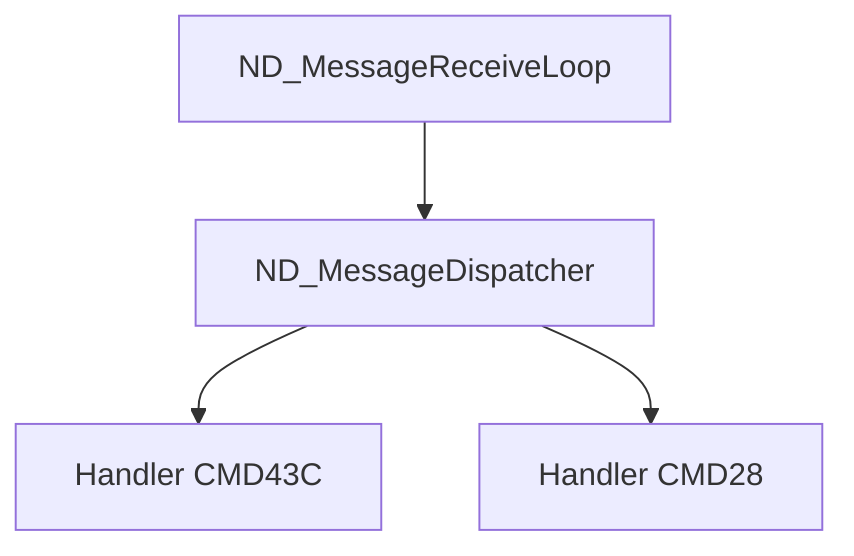

# NDserver Call Graph and Architecture Diagrams

Comprehensive visualization suite for understanding the NeXTSTEP NDserver daemon architecture, call relationships, and execution flows.

## Overview

This directory contains interactive Mermaid diagrams documenting the complete NDserver architecture across 88 functions, showing:

- **Call graph relationships** between all functions
- **Layer-based architecture** (4 layers: entry point → coordinators → intermediate → leaf)
- **Data flow** from command line to hardware operations
- **System architecture** showing user space, kernel, and hardware interactions
- **Critical execution paths** with sequence diagrams and timing analysis

## Diagram Files

### 1. [CALL_GRAPH_FULL.md](CALL_GRAPH_FULL.md) - Complete Call Graph
**Purpose**: Shows all 88 functions with their call relationships

**What you'll find**:
- Full flowchart of all function calls
- Color-coded by layer (entry point → coordinators → intermediate → leaf → isolated)
- Function sizes and addresses
- Critical functions highlighted
- Indirect calls (callbacks, dispatch tables) shown with dotted lines

**Best for**:
- Understanding overall code structure
- Finding dependencies between functions
- Identifying critical components (DMA engine, message dispatcher, hardware access)
- Locating callback functions and utilities

**Statistics**:
- Total functions: 88
- Analyzed functions: 29 (33%)
- Isolated functions: 59 (67%)
  - Callbacks: 24
  - Hardware access: 12
  - Utility/helper: 33

### 2. [CALL_GRAPH_LAYERS.md](CALL_GRAPH_LAYERS.md) - Layer-Focused View
**Purpose**: Simplified hierarchical view of the 4-layer architecture

**What you'll find**:
- Clean separation of architectural layers
- Execution flow from entry point to leaves
- Design patterns (coordinator pattern, message handler pattern, callback pattern)
- Metrics and statistics for each layer

**Best for**:
- High-level architecture understanding
- Identifying design patterns
- Understanding separation of concerns
- Quick reference for layer responsibilities

**Layer breakdown**:
- **Layer 3**: 1 function (ND_ServerMain - entry point)
- **Layer 2**: 3 functions (Init, Setup, Load - coordinators)
- **Layer 1**: 4 functions (MessageLoop, kernel loading - intermediate)
- **Layer 0**: 21 functions (handlers, validators, DMA, i860 control - leaves)
- **Isolated**: 59 functions (callbacks, hardware, utilities)

### 3. [DATA_FLOW.md](DATA_FLOW.md) - Data Flow Diagrams
**Purpose**: Visualizes how data flows through the system

**What you'll find**:
- High-level data flow from CLI → hardware
- Detailed data structure definitions
- Three flow scenarios:
  1. Boot sequence
  2. Display PostScript command processing
  3. DMA transfer (host ↔ board)
- Memory region maps (host and i860 address spaces)
- Data transformation pipeline
- Bandwidth and latency analysis

**Best for**:
- Understanding data transformations
- Learning communication protocols
- Memory mapping comprehension
- Performance analysis

### 4. [MODULE_ARCHITECTURE.md](MODULE_ARCHITECTURE.md) - System Architecture
**Purpose**: Shows the complete system from applications to hardware

**What you'll find**:
- Three-layer view: User space → Kernel space → Hardware
- Component interactions (NDserver, Mach IPC, IOKit, NeXTBus, NeXTdimension board)
- Communication protocols (Mach IPC, ioctl, mailbox, DMA)
- Address space maps (68040 and i860 views)
- Interrupt handling mechanisms
- Performance characteristics and fault tolerance

**Best for**:
- Understanding system-level architecture
- Learning OS interaction patterns
- Hardware interfacing details
- Security and privilege separation

**Key components**:
- **User space**: Client apps, NDserver daemon
- **Kernel space**: Mach IPC, VM, IOKit drivers
- **Hardware**: NeXTcube host, NeXTdimension board (i860, DRAM, VRAM)
- **Firmware**: Boot ROM, GaCK kernel, DPS server

### 5. [CRITICAL_PATHS.md](CRITICAL_PATHS.md) - Execution Sequences
**Purpose**: Detailed sequence diagrams of key operations

**What you'll find**:
- 6 critical execution paths:
  1. **Boot and initialization** (500-1000 ms)
  2. **Message processing flow** (400 μs - 10 ms)
  3. **DMA transfer sequence** (100 μs - 50 ms)
  4. **Firmware load and i860 start** (500 ms - 1 second)
  5. **Hardware register access** (~50 μs)
  6. **Error recovery path** (1.6 seconds)
- Timing analysis for each path
- Error handling and recovery procedures
- Performance bottlenecks and optimization opportunities

**Best for**:
- Understanding temporal behavior
- Performance optimization
- Debugging timing issues
- Learning error handling strategies

**Performance summary**:
- Boot: 500 ms typical
- Message dispatch: 500 μs typical
- DMA (4KB): 150 μs typical
- DPS command: 1 ms - 20 ms (varies by complexity)

## How to Use These Diagrams

### For Newcomers
**Recommended reading order**:
1. Start with **CALL_GRAPH_LAYERS.md** - Get the big picture
2. Read **MODULE_ARCHITECTURE.md** - Understand system context
3. Check **CRITICAL_PATHS.md** (Section 1: Boot) - See how it all starts
4. Explore **DATA_FLOW.md** - Learn data transformations
5. Reference **CALL_GRAPH_FULL.md** - Deep dive into specific functions

### For Debugging
**Use cases**:
- **Boot failure**: Check CRITICAL_PATHS.md Section 1, cross-reference MODULE_ARCHITECTURE.md
- **Message not processed**: CRITICAL_PATHS.md Section 2 + CALL_GRAPH_FULL.md (message handlers)
- **DMA issue**: CRITICAL_PATHS.md Section 3 + DATA_FLOW.md (DMA scenario)
- **i860 crash**: CRITICAL_PATHS.md Section 6 (error recovery)
- **Performance problem**: DATA_FLOW.md (bandwidth analysis) + CRITICAL_PATHS.md (timing)

### For Reverse Engineering
**Analysis workflow**:
1. Identify function in **CALL_GRAPH_FULL.md**
2. Find its layer in **CALL_GRAPH_LAYERS.md**
3. Understand its role in **CRITICAL_PATHS.md** sequences
4. Check data structures in **DATA_FLOW.md**
5. Verify system interaction in **MODULE_ARCHITECTURE.md**

### For Implementation/Emulation
**Development guide**:
1. Use **MODULE_ARCHITECTURE.md** to understand required components
2. Implement layers bottom-up using **CALL_GRAPH_LAYERS.md**
3. Verify data flows with **DATA_FLOW.md**
4. Test critical paths from **CRITICAL_PATHS.md**
5. Cross-check function calls with **CALL_GRAPH_FULL.md**

## Viewing the Diagrams

### GitHub
All Mermaid diagrams render automatically in GitHub's Markdown viewer. Just click the file and scroll.

### Local Viewing
**Option 1: VS Code**
- Install "Markdown Preview Mermaid Support" extension
- Open any .md file and press `Ctrl+Shift+V` (or `Cmd+Shift+V` on macOS)

**Option 2: Mermaid Live Editor**
- Visit https://mermaid.live/
- Copy/paste diagram code
- Edit and export as SVG/PNG

**Option 3: Command Line**
```bash
# Install mermaid-cli
npm install -g @mermaid-js/mermaid-cli

# Render to SVG
mmdc -i CALL_GRAPH_FULL.md -o call_graph.svg

# Render to PNG
mmdc -i CRITICAL_PATHS.md -o critical_paths.png -w 2000
```

### Browser
**Chrome/Firefox with extension**:
- Install "Mermaid Preview" or "Markdown Viewer"
- Open .md files directly

## Diagram Conventions

### Colors
- **Red**: Entry point (Layer 3)
- **Teal**: High-level coordinators (Layer 2)
- **Blue**: Intermediate orchestrators (Layer 1)
- **Green**: Leaf functions (Layer 0)
- **Yellow**: Isolated functions (uncalled/callbacks)
- **Pink**: Callback functions
- **Orange**: Hardware access functions
- **Light Green**: Utility/helper functions

### Line Styles
- **Solid arrow** (→): Direct function call
- **Dotted arrow** (.→): Indirect call (callback, function pointer, dispatch table)
- **Bold line**: Critical path
- **Dashed box**: Subgraph/grouping

### Annotations
- **\<b>BOLD\</b>**: Critical component
- **Size in bytes**: Function size from binary
- **Address (0xXXXX)**: Actual address in binary
- **Layer N**: Architectural layer number

## Integration with Documentation

### Function Documentation Cross-Reference
Each function shown in diagrams has a corresponding detailed analysis:

```
docs/functions/
  ├── 00002dc6_ND_ServerMain.md
  ├── 0000399c_ND_MessageReceiveLoop.md
  ├── 0000709c_ND_ProcessDMATransfer.md
  └── ... (29 total analyzed functions)
```

**How to navigate**:
1. Find function in diagram (e.g., `ND_ServerMain` @ 0x2dc6)
2. Look for corresponding file: `docs/functions/00002dc6_ND_ServerMain.md`
3. Read detailed analysis with assembly, data structures, and algorithms

### Database Cross-Reference
Diagrams are generated from these source files:

```
database/
  ├── analysis_order.json           # Call graph and layer data
  ├── isolated_functions_categorization.json  # Categories for isolated funcs
  └── ...
ghidra_export/
  └── functions.json                 # Function metadata (size, address)
```

**Data lineage**:
```
Ghidra analysis
  → ghidra_export/functions.json
    → Python analysis scripts
      → database/*.json
        → Mermaid diagram generation
          → docs/diagrams/*.md
```

## Advanced Usage

### Filtering for Specific Analysis

**Show only critical path functions**:
```bash
# Extract just the critical functions from CALL_GRAPH_FULL.md
grep -E "(ND_ServerMain|ND_ProcessDMA|ND_MessageLoop)" CALL_GRAPH_FULL.md
```

**List all callback functions**:
```bash
# Find all callback functions
grep ":::callback" CALL_GRAPH_FULL.md
```

**Find hardware access points**:
```bash
# Locate hardware access functions
grep "HardwareAccess\|0x040105" *.md
```

### Generating Custom Views

**Create a focused subgraph**:


**Performance-focused view**:
- Extract timing data from CRITICAL_PATHS.md
- Create custom Gantt chart showing execution timeline
- Identify optimization opportunities

### Exporting for Presentations

**High-resolution SVG**:
```bash
mmdc -i CALL_GRAPH_FULL.md -o presentation/architecture.svg -w 3000
mmdc -i MODULE_ARCHITECTURE.md -o presentation/system.svg -w 2500
```

**PDF export** (for documents):
```bash
# Convert SVG to PDF
rsvg-convert -f pdf -o architecture.pdf architecture.svg
```

## Diagram Statistics

### CALL_GRAPH_FULL.md
- **Nodes**: 88 functions + 3 subgraphs = 91 total nodes
- **Edges**: ~120 direct calls + ~30 indirect calls = ~150 edges
- **Complexity**: High (may be slow to render in some viewers)
- **Rendering time**: ~2-5 seconds

### CALL_GRAPH_LAYERS.md
- **Nodes**: 5 layers + 15 function groups = 20 nodes
- **Edges**: ~25 connections
- **Complexity**: Low (fast rendering)
- **Rendering time**: <1 second

### MODULE_ARCHITECTURE.md
- **Nodes**: 30 components across 4 layers
- **Edges**: ~40 connections
- **Complexity**: Medium
- **Rendering time**: ~1 second

### DATA_FLOW.md
- **Diagrams**: 4 separate diagrams
- **Nodes per diagram**: 10-20
- **Complexity**: Medium
- **Rendering time**: ~1 second per diagram

### CRITICAL_PATHS.md
- **Diagrams**: 6 sequence diagrams
- **Participants per diagram**: 4-8
- **Messages per diagram**: 15-50
- **Complexity**: High for detailed sequences
- **Rendering time**: ~2 seconds per diagram

## Known Rendering Issues

### Large Diagrams
**Issue**: CALL_GRAPH_FULL.md may be slow in some viewers
**Solution**: Use CALL_GRAPH_LAYERS.md for overview, then zoom into specific areas

### Mermaid Limitations
**Issue**: Cannot show 88 functions clearly in one diagram
**Workaround**: Functions grouped into subgraphs, use click handlers (if supported)

### Browser Performance
**Issue**: Complex sequence diagrams may lag in older browsers
**Solution**: Export to SVG/PNG for viewing

## Contributing

### Adding New Diagrams
1. Place in `docs/diagrams/`
2. Use consistent naming: `CATEGORY_DESCRIPTION.md`
3. Follow color scheme and annotation conventions
4. Update this README with description
5. Cross-reference with function documentation

### Updating Existing Diagrams
1. Modify Mermaid source in .md file
2. Test rendering locally
3. Verify cross-references still valid
4. Update statistics in this README
5. Increment version note if major changes

### Diagram Standards
- **Line length**: Max 120 characters in diagram code
- **Comments**: Use `%%` for Mermaid comments
- **Styling**: Define `classDef` at top
- **Labels**: Keep concise, use `<br/>` for multi-line
- **Subgraphs**: Use for logical grouping only

## Future Enhancements

### Planned Additions
- [ ] **Interactive HTML version** with clickable nodes linking to function docs
- [ ] **3D call graph** showing depth and complexity metrics
- [ ] **Animation** showing execution flow through time
- [ ] **Differential diagrams** comparing different versions
- [ ] **Coverage overlay** showing analyzed vs. unanalyzed functions

### Tool Integration
- [ ] **Ghidra plugin** to auto-generate diagrams from analysis
- [ ] **VS Code extension** for live diagram updates
- [ ] **Web dashboard** for interactive exploration
- [ ] **PDF documentation** with embedded diagrams

## Resources

### Mermaid Documentation
- Official docs: https://mermaid.js.org/
- Live editor: https://mermaid.live/
- Syntax reference: https://mermaid.js.org/intro/syntax-reference.html

### Related Documentation
- [Main README](../../README.md)
- [Function Documentation](../functions/)
- [Analysis Reports](../../database/)
- [Ghidra Export](../../ghidra_export/)

### Tools
- **Mermaid CLI**: https://github.com/mermaid-js/mermaid-cli
- **VS Code Extension**: "Markdown Preview Mermaid Support"
- **Browser Extension**: "Mermaid Preview"

## Quick Reference

### Common Tasks

| Task | Command/File |
|------|--------------|
| Find function in call graph | Search CALL_GRAPH_FULL.md |
| Understand layer structure | Read CALL_GRAPH_LAYERS.md |
| Learn data flow | See DATA_FLOW.md scenarios |
| Debug boot issue | CRITICAL_PATHS.md Section 1 |
| Check message handling | CRITICAL_PATHS.md Section 2 |
| Understand DMA | CRITICAL_PATHS.md Section 3 |
| System architecture | MODULE_ARCHITECTURE.md |
| Performance analysis | DATA_FLOW.md + CRITICAL_PATHS.md |

### Function Lookup Table

| Function | Address | Layer | Diagram Location |
|----------|---------|-------|------------------|
| ND_ServerMain | 0x2dc6 | 3 | All diagrams |
| ND_InitializeBoardWithParameters | 0x5bb8 | 2 | CALL_GRAPH_*.md, CRITICAL_PATHS.md |
| ND_SetupBoardWithParameters | 0x5af6 | 2 | CALL_GRAPH_*.md, CRITICAL_PATHS.md |
| ND_LoadFirmwareAndStart | 0x5a3e | 2 | CALL_GRAPH_*.md, CRITICAL_PATHS.md |
| ND_MessageReceiveLoop | 0x399c | 1 | CALL_GRAPH_*.md, CRITICAL_PATHS.md |
| ND_MessageDispatcher | 0x6e6c | 0 | CALL_GRAPH_FULL.md, CRITICAL_PATHS.md |
| ND_ProcessDMATransfer | 0x709c | 0 | All diagrams (critical) |
| ND_WriteBranchInstruction | 0x746c | 0 | CRITICAL_PATHS.md Section 4 |

---

**Last Updated**: 2025-11-08
**Diagrams Version**: 1.0
**Total Diagrams**: 5 files
**Total Functions Documented**: 88
**Analyzed Functions**: 29 (33%)
